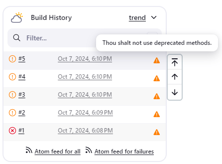
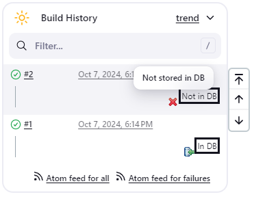
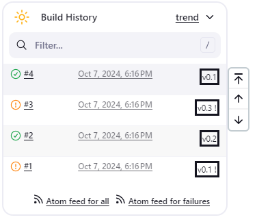
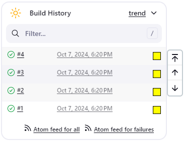

# Groovy postbuild plugin

This plugin executes a groovy script in the Jenkins JVM as a post-build action (a publisher) .
Typically, the script checks some conditions and updates the build result, puts badges next to the build in the build history, and/or displays information on the build summary page.

## Usage

The groovy script can use the variable `manager`, which provides various methods to decorate your builds.
Those methods can be classified into *approved methods* and *non-approved methods*.
You can always use *approved methods*, but you can use *non-approved methods* only when "Enable groovy postbuild security" scripts are approved by administrators.

### Approved methods

-   `getEnvVariable(key)` - get a variable value.
-   `getResult()` - get a build result string (like SUCCESS, FAILURE)

#### Log methods

-   `logContains(regexp)` - returns true if the build log file contains a line matching *regexp*.
-   `getLogMatcher(regexp)` - returns a [java.util.regex.Matcher](https://docs.oracle.com/en/java/javase/11/docs/api/java.base/java/util/regex/Matcher.html) for the first occurrence of *regexp* in the build log file.

#### Short text methods

-   `addShortText(text)` - puts a badge with a short text, using the default format.
-   `addShortText(text, color, background, border, borderColor)` - puts a badge with a short text, using the specified format.
    Supports html color names.

#### Badge methods

-   `addBadge(icon, text, link)` - like addBadge(icon, text), but the Badge icon then actually links to the given link
-   `addInfoBadge(text)` - puts a badge with  info icon and the given text.
-   `addWarningBadge(text)` - puts a badge with  warning icon and the given text.
-   `addErrorBadge(text)` - puts a badge with  error icon and the given text.
-   `addHtmlBadge(html)` - puts a badge with html source. Unsafe html codes will be removed.
-   `removeBadges()` - removes all badges from the current build. It is often used with `setBuildNumber`.
-   `removeBadge(index)` - removes the badge with the given index. It is often used with `setBuildNumber`.
-   `addBadge(icon, text)` - puts a badge with the given icon and text.
    Provides the following icons:

    >  - completed.gif
    >
    >  - db\_in.gif
    >
    >  - db\_out.gif
    >
    >  - delete.gif
    >
    >  -  error.gif
    >
    >  - folder.gif
    >
    >  - green.gif
    >
    >  - info.gif
    >
    >  - red.gif
    >
    >  - save.gif
    >
    >  - success.gif
    >
    >  - text.gif
    >
    >  - warning.gif
    >
    >  - yellow.gif

#### Build result methods

-   `buildUnstable()` - sets the build result to *UNSTABLE*.
-   `buildFailure()` - sets the build result to *FAILURE*.
-   `buildSuccess()` - sets the build result to *SUCCESS*.

#### Job type methods

-   `buildIsA(klass)` - test the build is a specified class

### Non-approved methods

Methods returning non-primitive objects aren't approved.
The groovy postbuild plugin doesn't ensure that the methods of the returned object are safe.

-   `build` - the current build - [javadoc](https://javadoc.jenkins.io/hudson/model/AbstractBuild.html)
-   `jenkins` - the current controller instance - [javadoc](https://javadoc.jenkins.io/jenkins/model/Jenkins.html)
-   `listener` - the build listener - [javadoc](https://javadoc.jenkins.io/hudson/model/BuildListener.html)

#### Environment variables

-   `envVars` - the build variables map. You can get a variable value with

    ```groovy
    manager.envVars['varname']
    ```

    Do not update the returned values.
    This method is not recommended for any use.
    Use `getEnvVariable(key)` instead.

#### File content matching

-   `contains(file, regexp)` - returns true if the given file contains a line matching *regexp*.
    Not approved as it allows users access any files (for example, a file containing passwords).
-   `getMatcher(file, regexp)` - returns a [java.util.regex.Matcher](https://docs.oracle.com/en/java/javase/11/docs/api/java.base/java/util/regex/Matcher.html) for the first occurrence of *regexp* in the given file.

#### Build number control

-   `setBuildNumber(number)` - sets the build with the given number as current build.
    The current build is the target of all methods that add or remove badges and summaries or change the build result.

#### Summary modification

-   `createSummary(icon)` - creates an entry in the build summary page and
    returns a *summary* object corresponding to this entry. The icon
    must be one of the [48x48 icons](https://github.com/jenkinsci/jenkins/tree/master/war/src/main/webapp/images/48x48)
    offered by Jenkins. You can append text to the *summary* object by
    calling its *appendText* methods. Be careful appending
    HTML-unescaped texts as they can be harmful.
    -   `appendText(text, escapeHtml)`
    -   `appendText(text, escapeHtml, bold, italic, color)`
-   `removeSummaries()` - removes all summaries from the current build.
-   `removeSummary(index)` - removes the summary with the given index.

### Example usages

#### Example 1

The script below puts a warning badge and mark the build as unstable if it detects that deprecated methods were used.

```groovy
if(manager.logContains(".*uses or overrides a deprecated API.*")) {
    manager.addWarningBadge("Thou shalt not use deprecated methods.")
    manager.createSummary("warning.gif").appendText("<h1>Warned!</h1>", false, false, false, "red")
    manager.buildUnstable()
}
```



#### Example 2

Suppose we have a parameterized build, which uses the boolean parameter *storeToDB* in order to instruct the build to store some artifacts into the database.
The script below puts a badge next to the builds for which this parameter is set with short text.

```groovy
// Declarative Pipeline script block
if (params.storeToDB) {
    manager.addBadge("db_in.gif", "Stored in DB")
} else {
    manager.addBadge("delete.gif", "Not stored in DB")
}
manager.addShortText(params.storeToDB ? "In DB" : "Not in DB")
```



#### Example 3

Suppose we have a parameterized build, which uses the string parameter *version*.
The script below puts a short text indicating the value of this parameter next to successful and unstable builds.

```groovy
if(manager.build.result.isBetterOrEqualTo(hudson.model.Result.UNSTABLE)) {
    manager.addShortText("v${manager.build.buildVariables.get('version')}")
}
```



#### Example 4

The script below determines how long it took to build the project and displays the corresponding value as a short text next to each build.

```groovy
def matcher = manager.getLogMatcher(".*Total time: (.*)\$")
if(matcher?.matches()) {
    manager.addShortText(matcher.group(1), "grey", "white", "0px", "white")
}
```


#### Example 5

For badges, you can choose from the icons provided by this plugin.
If the name of a groovy-postbuild icon conflicts with the name of a Jenkins icon, provide the complete path to the icon.

```groovy
manager.addBadge("yellow.gif", "icon from groovy-postbuild plugin")
```



## Issues

To report a bug or request an enhancement to this plugin please create a ticket in JIRA (you need to login or to sign up for an account).
Please review and follow the instructions in ["How to report an issue"](https://www.jenkins.io/participate/report-issue/).

-   [Open Issues](https://issues.jenkins.io/issues/?jql=resolution%20is%20EMPTY%20and%20component%3D15685)
-   [Bug report or enhancement request](https://www.jenkins.io/participate/report-issue/redirect/#15685)

## Changelog in [GitHub Releases](https://github.com/jenkinsci/groovy-postbuild-plugin/releases)

Release notes have been recorded in [GitHub](https://github.com/jenkinsci/groovy-postbuild-plugin/releases) since release 2.4.
Prior release notes are in the historical [change log](https://github.com/jenkinsci/groovy-postbuild-plugin/blob/228.vcdb_cf7265066/CHANGELOG.md).

## Migration from 1.X

Beginning with version 2.0 (September 2014), Groovy Postbuild plugin introduces [Script Security Plugin](https://plugins.jenkins.io/script-security/).
Administrators can prevent users without proper privileges from running harmful scripts.

For details, see [Script Security Plugin](https://plugins.jenkins.io/script-security/).
This doesn't affect [Jenkins without security enabled](https://www.jenkins.io/doc/book/security/securing-jenkins/) and
users with administrative privilege (to be exact, with RUN\_SCRIPTS
permission).

When you upgrade the Groovy Postbuild plugin from 1.X to 2.X, you and your Jenkins users
must update the configuration of Groovy Postbuild or they will fail with outputs like this:

    ERROR: Failed to evaluate groovy script.
    org.jenkinsci.plugins.scriptsecurity.scripts.UnapprovedUsageException: script not yet approved for use
        at org.jenkinsci.plugins.scriptsecurity.scripts.ScriptApproval.using(ScriptApproval.java:398)
        at org.jenkinsci.plugins.scriptsecurity.sandbox.groovy.SecureGroovyScript.evaluate(SecureGroovyScript.java:165)
        at org.jvnet.hudson.plugins.groovypostbuild.GroovyPostbuildRecorder.perform(GroovyPostbuildRecorder.java:343)
        at hudson.tasks.BuildStepMonitor$1.perform(BuildStepMonitor.java:20)
        at hudson.model.AbstractBuild$AbstractBuildExecution.perform(AbstractBuild.java:785)
        at hudson.model.AbstractBuild$AbstractBuildExecution.performAllBuildSteps(AbstractBuild.java:757)
        at hudson.model.Build$BuildExecution.post2(Build.java:183)
        at hudson.model.AbstractBuild$AbstractBuildExecution.post(AbstractBuild.java:706)
        at hudson.model.Run.execute(Run.java:1690)
        at hudson.model.FreeStyleBuild.run(FreeStyleBuild.java:46)
        at hudson.model.ResourceController.execute(ResourceController.java:88)
        at hudson.model.Executor.run(Executor.java:246)

### Scripts using only approved methods of manager

Scripts using only [approved methods of manager](/#Approved-Methods) can run with the Groovy sandbox.
They can be validated by running with "Use Groovy Sandbox" checked in the job definition.


### Scripts using non-approved methods

Scripts using [non-approved methods of manager](/#Non-approved-methods) or methods not of manager require administrator approval.

Administrators should check and approve those scripts in Manage Jenkins \> In-process Script Approval.


### Scripts using external jar files

If you refer to external jar files from your scripts, those jar files must be approved by an administrator.

Administrators should check and approve those jar files in Manage \> In-process Script Approval.


### Scripts using external class directories

[Script Security Plugin](https://plugins.jenkins.io/script-security/) doesn't support class directories.

If you refer to external class directories from your scripts, you must archive them in jar files.
It can be performed by running a following command:

    jar -cf mylib.jar -C /path/to/classes .

You can use /path/to/mylib.jar as an additonal classpath for scripts.
